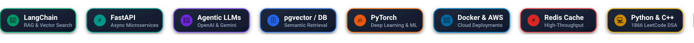

<div align="center">


<a href="https://github.com/himaenshuu">
  
</a>

<p align="center">
  <a href="https://linkedin.com/in/himaenshuu"></a>
  &nbsp;
  <a href="https://leetcode.com/u/himanshuraj830/"></a>
  &nbsp;
  <a href="https://hub.docker.com/u/himaenshuu"></a>
  &nbsp;
  <a href="mailto:himanshuraj.csd@gmail.com"></a>
</p>

<!-- Animated Floating Skills Sequence -->
<p align="center">
  
</p>

</div>

---

## 👨‍💻 About Me

I am a Computer Science undergraduate at **IIIT Nagpur** (Specialization in **Data Science**), passionate about designing high-performance, intelligent, and scalable distributed systems. 

My work combines solid algorithmic fundamentals with modern production engineering across **AI systems, backend architectures, vector search, and cloud deployments**:

```yaml
name:         Himanshu Raj
role:         AI Systems & Backend Engineer
education:    IIIT Nagpur (B.Tech CSE - Data Science)
specialties:  RAG Systems, Distributed Backends, Microservices, Vector Search
leetcode:     1866 Rating (370+ Solved)
open_source:  900+ Contributions (Axios, Fastify, Transformers, Appsmith)
```

---

## 🚀 Featured Architectures & Production Systems

<table>
  <tr>
    <td width="50%" valign="top">
      <h3>🧠 Multi-Modal RAG Orchestrator</h3>
      <p>
        
        
        
        
      </p>
      <ul>
        <li><b>Challenge:</b> Ingesting, parsing, and contextually querying heterogeneous multi-format documents (PDFs, images, tables) without token bloat.</li>
        <li><b>Architecture:</b> Hybrid semantic search pipeline combining dense vector embeddings with BM25 sparse lexical retrieval, re-ranking, and automated query refinement via LLM agents.</li>
        <li><b>Key Metrics:</b> Sub-250ms retrieval latency, zero hallucination guardrails, modular vector index containerization.</li>
      </ul>
      <p align="right">
        <a href="https://github.com/himaenshuu"><b>View Repository ➔</b></a>
      </p>
    </td>
    <td width="50%" valign="top">
      <h3>⚡ Scalable Distributed Microservice</h3>
      <p>
        
        
        
        
      </p>
      <ul>
        <li><b>Challenge:</b> Handling bursty API traffic and compute-heavy background tasks without blocking critical path requests.</li>
        <li><b>Architecture:</b> Asynchronous event-driven architecture featuring Redis Pub/Sub, distributed rate limiting, cache-aside strategies, and background worker queues.</li>
        <li><b>Key Metrics:</b> 99.9% uptime under high concurrency load, 4x lower database query load with intelligent caching.</li>
      </ul>
      <p align="right">
        <a href="https://github.com/himaenshuu"><b>View Repository ➔</b></a>
      </p>
    </td>
  </tr>
  <tr>
    <td width="50%" valign="top">
      <h3>🌐 Real-Time Streaming AI Interface</h3>
      <p>
        
        
        
        
      </p>
      <ul>
        <li><b>Challenge:</b> Delivering seamless real-time token streaming and dynamic multi-agent interaction with fluid UI state management.</li>
        <li><b>Architecture:</b> Next.js App Router fronted by server-sent events (SSE) and WebSockets, optimistic UI updates, and markdown/code syntax rendering.</li>
      </ul>
      <p align="right">
        <a href="https://github.com/himaenshuu"><b>View Repository ➔</b></a>
      </p>
    </td>
    <td width="50%" valign="top">
      <h3>💡 Production API Integrations & CI/CD</h3>
      <p>
        
        
        
      </p>
      <ul>
        <li><b>Challenge:</b> Building reliable third-party API adapters with strict contract validation and automated deployment.</li>
        <li><b>Architecture:</b> Type-safe validation using Pydantic, automated CI/CD unit testing, containerized health probes, and structured telemetry.</li>
      </ul>
      <p align="right">
        <a href="https://github.com/himaenshuu"><b>View Repository ➔</b></a>
      </p>
    </td>
  </tr>
</table>

---

## 🛠️ Technical Arsenal

<div align="center">

### 🤖 AI, Machine Learning & LLM Systems
<p align="center">
  
</p>
<p>
  <code>LangChain</code> • <code>LlamaIndex</code> • <code>OpenAI API</code> • <code>Gemini API</code> • <code>Hugging Face</code> • <code>ChromaDB</code> • <code>FAISS</code> • <code>Ollama</code>
</p>

<br/>

### ⚙️ Backend Engineering & APIs
<p align="center">
  
</p>
<p>
  <code>FastAPI</code> • <code>Node.js / Express</code> • <code>Pydantic</code> • <code>RESTful APIs</code> • <code>WebSockets / SSE</code> • <code>Redis Caching</code> • <code>Celery Task Queues</code>
</p>

<br/>

### 🗄️ Databases & Storage Engines
<p align="center">
  
</p>
<p>
  <code>PostgreSQL</code> • <code>MongoDB</code> • <code>Redis</code> • <code>Supabase</code> • <code>Neon Serverless PG</code> • <code>Vector Stores</code>
</p>

<br/>

### 💻 Core Programming Languages
<p align="center">
  
</p>
<p>
  <code>Python (AsyncIO / ML)</code> • <code>C++ (STL / Competitive Programming)</code> • <code>TypeScript</code> • <code>JavaScript (ES6+)</code> • <code>SQL</code>
</p>

<br/>

### ☁️ Cloud, DevOps & Infrastructure
<p align="center">
  
</p>
<p>
  <code>Docker & Compose</code> • <code>AWS (EC2, S3, IAM)</code> • <code>Linux / Bash</code> • <code>CI/CD (GitHub Actions)</code> • <code>Git Workflow</code> • <code>Vercel</code>
</p>

<br/>

### 🎨 Frontend & Full-Stack UI
<p align="center">
  
</p>
<p>
  <code>Next.js (App Router)</code> • <code>React.js</code> • <code>TailwindCSS</code> • <code>Responsive UI/UX</code>
</p>

</div>

---

## 🌟 Open Source & Upstream Contributions

I actively contribute to foundational developer tooling, web frameworks, and AI repositories:

<div align="center">

| Organization / Repository | Focus Area | Impact |
| :--- | :--- | :--- |
| **[Axios](https://github.com/axios/axios)** | HTTP Client & Core Networking | Bug fixes, TypeScript typings, and adapter optimizations |
| **[Fastify](https://github.com/fastify/fastify)** | High-Performance Node.js Framework | Plugin ecosystem improvements & routing benchmarks |
| **[Transformers](https://github.com/huggingface/transformers)** | Hugging Face State-of-the-Art ML | Pipeline documentation, tokenization helpers, and issue triage |
| **[Appsmith](https://github.com/appsmithorg/appsmith)** | Open Source Low-Code Engine | Backend API integration, widget connectors, and bug resolutions |

<br/>

<p align="center">
  
  &nbsp;
  
</p>

</div>

---

## 🏆 Competitive Programming & Problem Solving

<div align="center">

<p align="center">
  <a href="https://leetcode.com/u/himanshuraj830/">
    
  </a>
  &nbsp;
  <a href="https://leetcode.com/u/himanshuraj830/">
    
  </a>
  &nbsp;
  
</p>

</div>

---

## 🤝 Let's Connect & Collaborate

I am always excited to collaborate on **Generative AI systems**, **Scalable Backend Architectures**, and **Open-Source Infrastructure**. Feel free to reach out!

<div align="center">

<p align="center">
  <a href="https://linkedin.com/in/himaenshuu">
    
  </a>
  &nbsp;
  <a href="https://leetcode.com/u/himanshuraj830/">
    
  </a>
  &nbsp;
  <a href="mailto:himanshuraj.csd@gmail.com">
    
  </a>
  &nbsp;
  <a href="https://hub.docker.com/u/himaenshuu">
    
  </a>
</p>

<p>
  <i>Crafted with ⚡ and precision for high-impact software engineering.</i>
</p>

</div>
