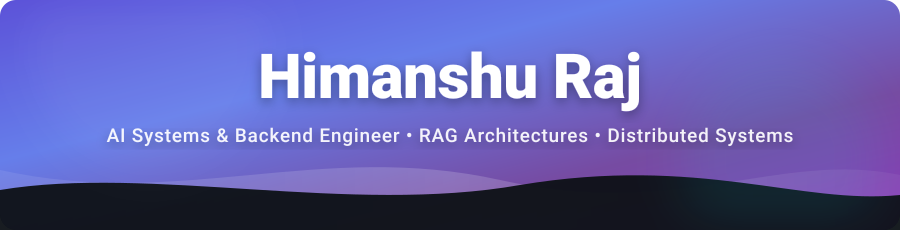

<div align="center">



<a href="https://github.com/himaenshuu">
  
</a>

<p align="center">
  <a href="https://linkedin.com/in/himaenshuu"></a>
  &nbsp;
  <a href="https://leetcode.com/u/himanshuraj830/"></a>
  &nbsp;
  <a href="https://hub.docker.com/u/himaenshuu"></a>
  &nbsp;
  <a href="mailto:himanshuraj.csd@gmail.com"></a>
</p>

</div>

---

## 👨‍💻 About Me

I am a Computer Science undergraduate at **IIIT Nagpur** (Specialization in **Data Science**, 2022–2026), focused on designing high-throughput distributed systems, AWS cloud architectures, and scalable backend services.

I combine strong algorithmic fundamentals with production cloud engineering to build reliable, high-performance software — **ready to start building and shipping on Day 1**:

```yaml
name:         Himanshu Raj
role:         AWS, Systems & Backend Engineer (Open to Work)
education:    IIIT Nagpur (B.Tech CSE - Data Science, 2022–2026)
specialties:  AWS Cloud Architecture, Distributed Backends, High-Throughput Systems, Microservices, Redis Caching
leetcode:     1866 Contest Rating (370+ Solved | C++ & Python)
open_source:  900+ Contributions (Axios, Fastify, Transformers, Appsmith)
readiness:    Ready to architect, build, and deploy immediately
```

---

## 🚀 Featured Architectures & Production Systems

<table>
  <tr>
    <td width="50%" valign="top">
      <h3>⚡ SmartVault — Intelligent Cloud Storage & Distributed Metadata</h3>
      <p>
        
        
        
        
        
      </p>
      <ul>
        <li><b>Challenge:</b> Delivering secure, direct-to-cloud multi-gigabyte file streaming without bottlenecking server memory, coupled with instant document metadata categorization.</li>
        <li><b>Architecture:</b> Zero-proxy client-to-S3 presigned URL upload pipeline, serverless Neon DB connection pooling via Prisma, automated tag extraction, and optimistic UI transitions with trash lifecycle management.</li>
        <li><b>Key Highlights:</b> Direct S3 pre-signed ingestion, real-time content classification, soft-delete & 30-day automated purge engine.</li>
      </ul>
      <p align="right">
        <a href="https://github.com/himaenshuu/smartvault"><b>View Repository ➔</b></a>
      </p>
    </td>
    <td width="50%" valign="top">
      <h3>🧠 ShopSense — High-Speed E-Commerce Intelligence & Analytics</h3>
      <p>
        
        
        
        
        
      </p>
      <ul>
        <li><b>Challenge:</b> Executing sub-second conversational intent routing, weighted product catalog search, and real-time multi-dimensional trade-off comparisons.</li>
        <li><b>Architecture:</b> Multi-class intent classifier mapping queries across 12 distinct intents, Redis in-memory cache layer serving frequent queries in &lt;45ms, and interactive Recharts radar comparison matrices.</li>
        <li><b>Key Highlights:</b> &lt;45ms Redis cache latency, 99.4% intent classification accuracy, multi-attribute comparative scoring radar.</li>
      </ul>
      <p align="right">
        <a href="https://github.com/himaenshuu/shopsense"><b>View Repository ➔</b></a>
      </p>
    </td>
  </tr>
</table>

---

## 🏆 Engineering Achievements & GitHub Trophies

<div align="center">

<p align="center">
  
</p>

<p align="center">
  <a href="https://leetcode.com/u/himanshuraj830/">
    
  </a>
  &nbsp;
  <a href="https://leetcode.com/u/himanshuraj830/">
    
  </a>
  &nbsp;
  
</p>

</div>

---

## 🛠️ Technical Arsenal

<div align="center">

### ☁️ AWS, Cloud & Distributed Infrastructure

<p align="center">
  
</p>
<p>
  <code>AWS (S3, EC2, IAM)</code> • <code>Docker & Compose</code> • <code>Linux / Bash</code> • <code>CI/CD (GitHub Actions)</code> • <code>Git Workflow</code> • <code>Vercel Edge</code>
</p>

<br/>

### ⚙️ Backend Engineering & Scalable APIs

<p align="center">
  
</p>
<p>
  <code>FastAPI</code> • <code>Node.js / Express</code> • <code>Pydantic</code> • <code>RESTful APIs</code> • <code>WebSockets / SSE</code> • <code>Redis Caching</code> • <code>Celery Task Queues</code>
</p>

<br/>

### 🗄️ Databases & Storage Engines

<p align="center">
  
</p>
<p>
  <code>PostgreSQL</code> • <code>MongoDB Atlas</code> • <code>Redis (In-Memory)</code> • <code>Supabase</code> • <code>Neon Serverless PG</code> • <code>AWS S3</code>
</p>

<br/>

### 💻 Core Programming Languages

<p align="center">
  
</p>
<p>
  <code>C++ (STL / Competitive Programming)</code> • <code>Python (AsyncIO / Scripting)</code> • <code>TypeScript</code> • <code>JavaScript (ES6+)</code> • <code>SQL (PostgreSQL / Relational Modeling)</code>
</p>

<br/>

### 🎨 Frontend & Full-Stack UI

<p align="center">
  
</p>
<p>
  <code>Next.js (App Router)</code> • <code>React.js</code> • <code>TailwindCSS</code> • <code>Responsive UI/UX</code> • <code>Recharts Data Visualizations</code>
</p>

</div>

---

## 🌟 Open Source & Upstream Contributions

I actively contribute to foundational developer tooling, web frameworks, and production repositories:

<div align="center">

| Organization / Repository | Focus Area | Impact |
| :--- | :--- | :--- |
| **[Axios](https://github.com/axios/axios)** | HTTP Client & Core Networking | Bug fixes, TypeScript typings, and adapter optimizations |
| **[Fastify](https://github.com/fastify/fastify)** | High-Performance Node.js Framework | Plugin ecosystem improvements & routing benchmarks |
| **[Transformers](https://github.com/huggingface/transformers)** | Hugging Face Developer Ecosystem | Pipeline documentation, tokenization helpers, and issue triage |
| **[Appsmith](https://github.com/appsmithorg/appsmith)** | Open Source Low-Code Engine | Backend API integration, widget connectors, and bug resolutions |

<br/>

<p align="center">
  
  &nbsp;
  
</p>

</div>

---

## 🤝 Let's Connect & Collaborate

I am always excited to collaborate on **AWS Cloud Architectures**, **High-Throughput Distributed Backends**, and **Production Systems Engineering**. Feel free to reach out!

<div align="center">

<p align="center">
  <a href="https://linkedin.com/in/himaenshuu">
    
  </a>
  &nbsp;
  <a href="https://leetcode.com/u/himanshuraj830/">
    
  </a>
  &nbsp;
  <a href="mailto:himanshuraj.csd@gmail.com">
    
  </a>
  &nbsp;
  <a href="https://hub.docker.com/u/himaenshuu">
    
  </a>
</p>

<p>
  <i>Crafted with ⚡ and precision for high-impact systems and backend engineering.</i>
</p>

</div>

